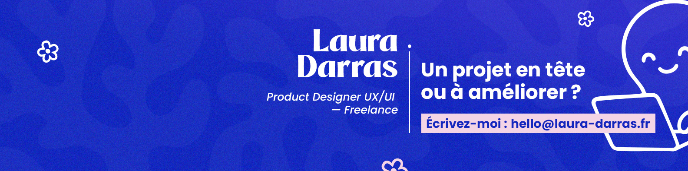

# 👋 Concevoir, coder, optimiser : bienvenue dans mon univers !

  
## 👩‍💻 À propos de moi  

Moi c'est Laura, Product Designer & Full-stack Designer.

- 🎨 +10 ans d'expérience en design et tech
- 🧠 Experte en interfaces simples, durables et cohérentes
- 🖥 Analyse des besoins, définition des parcours, conception d'interfaces & développement front-end

💡 **Pourquoi faire appel à moi ?**

Je ne me contente pas de livrer un design, je résous vos vrais problèmes :

- ✅ **Gagner du temps** : prise en charge complète du projet pour que vos équipes se concentrent sur leur cœur de métier
- ✅ **Assurer la qualité** : solutions fiables, cohérentes et centrées utilisateur
- ✅ **Faciliter la collaboration** : lien entre design et technique pour avancer vite et sereinement
- ✅ **Créer de la valeur** : expériences pertinentes qui séduisent vos utilisateurs et soutiennent vos objectifs

 

## 🛠️ Compétences  

- 🎨 **Mes expertises** :  
- 🔍 UX : Interviews, Ateliers, Tests utilisateurs, Analyses de données, User flows, Personas, Jobs to be done, Site map
- 🖌️ UI : Wireframes, Prototypes, Accessibilité, Design systems, Composants UI, Guidelines
- 💻 Front-end : HTML, SCSS, Javascript, Bootstrap, Angular, Svelt, Wordpress

🌐 **Langages & Frameworks** :  
- HTML, CSS, SCSS, JavaScript
- Bootstrap, Wordpress (builder DIVI, ELEMENTOR)
- Angular JS, Svelte

🔧 **Outils** :  
- Design : Figma, Adobe Suite
- Tech : VS Code, Webstorm, GitHub, Bugherd
- Collaboration : Monday, Slack, Notion, Teams

🤝 **Gestion de projet** :  
- Monday, Slack, Google suite, Notion

  

## 📂 Projets  

📌 **[O'chat](https://github.com/Laura-Darras/DEV_OCHAT)** – Application de messagerie interactive permettant conversations utilisateurs avec IA intégrée (Svelt,Bootstrap, scss)

  

## 📫 Contact  

- 📧 **Email** : darras.laura@gmail.com 
- 💼 **LinkedIn** : [Profils Linkedin](https://www.linkedin.com/in/laura-darras/)
- 💼 **Malt** : [Profils Linkedin](https://www.malt.fr/profile/lauradarras)
- 🌍 **Design** : [Behance](https://www.behance.net/darraslaura)  
- 🎨 **Figma** : [Figma](https://www.figma.com/@lauradarras)  

  

👋 À très vite,
